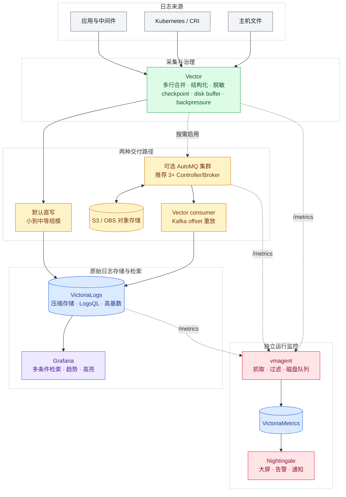
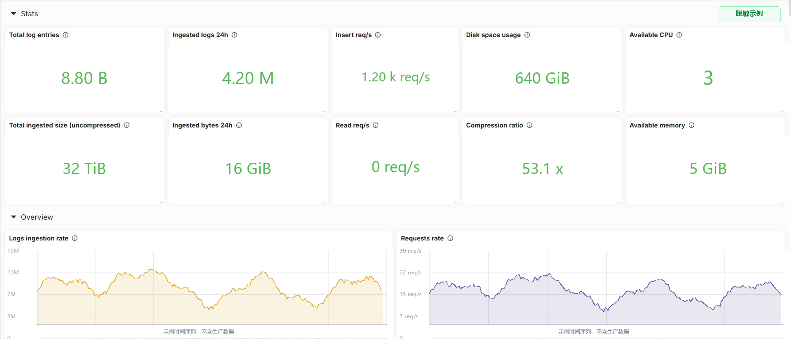
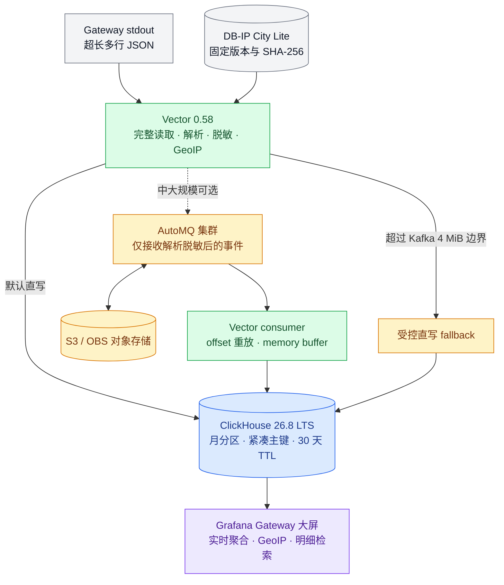

# VVG 日志收集系统

> 用一套开放、可验证、可回滚的日志链路，把高吞吐采集、低成本存储和快速排障能力交给每一个研发与运维团队。

VVG 是面向 Kubernetes、容器和传统主机的高性能日志平台。它不是简单拼接几个开源组件，
而是围绕真实生产问题，把采集、缓冲、存储、检索、可视化和监控拆成清晰的职责边界。
默认主链路保持轻量：

```text
Vector -> VictoriaLogs -> Grafana
```

面向 AI Agent 的受控只读查询链路为：

```text
MCP Client -> mcp-victorialogs -> vmauth -> VictoriaLogs
```

核心验证基线：Vector `0.58.0`、VictoriaLogs `v1.52.0`、Grafana `13.2.0-ubuntu`、VictoriaLogs datasource `0.31.0`、Business Text `6.3.0`、VictoriaLogs MCP `v1.9.0`、vmauth `v1.151.0`。Grafana 插件采用版本化宿主机 release 目录和只读挂载，与 Grafana 镜像解耦，正式启动不联网安装。

## 项目背景

微服务数量增长以后，日志系统通常会同时遇到四类挑战：容器日志轮转快、Java 堆栈容易
被拆散；流量峰值或后端维护会放大积压；传统全文检索集群资源开销和运维复杂度较高；
而研发真正需要的是快速缩小范围、看到上下文并立即定位问题，而不是先学习一套复杂语法。

VVG 因此采用“主链路轻量、缓冲层可选、分析链路分离、监控独立”的设计：小到中等规模
直接写入 VictoriaLogs，减少组件和故障面；吞吐或可靠性需求提升后再加入 AutoMQ；
Gateway 结构化访问日志使用 ClickHouse 做实时聚合；运行指标通过 vmagent 写入
VictoriaMetrics，再由夜莺统一展示和告警。

## 为什么选择这套架构

| 设计原则 | 实现方式 | 带来的价值 |
|---|---|---|
| 数据入口保持开放 | Vector 统一采集、解析、脱敏和路由 | 同一份日志可投递到 VictoriaLogs、AutoMQ、ClickHouse 等后端，降低厂商锁定风险 |
| 默认路径足够简单 | Vector 直接写 VictoriaLogs | 组件少、部署快、资源利用率高，适合大多数小到中等规模场景 |
| 扩容不推翻原方案 | 中大规模按需加入 AutoMQ + 对象存储 | 吸收流量尖峰、支持 Kafka offset 重放，并把长期容量交给价格更低的对象存储 |
| 原始检索与结构化分析分工 | VictoriaLogs 保存原始日志，ClickHouse 分析 Gateway 结构化事件 | 全文检索和实时聚合各用擅长的引擎，避免一套存储承担所有负载 |
| 展示和告警各取所长 | Grafana 服务研发检索，夜莺负责运行监控与告警 | 既保留灵活查询体验，也具备业务组、规则、通知和恢复状态管理 |
| 可靠性可以验证和回滚 | checkpoint、disk buffer、acknowledgement、固定版本和 CI 校验 | 每次部署都有明确边界、验证证据和回滚入口，不依赖现场手工记忆 |

仓库后半部分提供独立的[运行监控附加方案](#附加方案automq-与-victorialogs-运行监控)
和 [Gateway 结构化日志分析附加方案](#附加方案gateway-结构化日志分析)。附加能力不会改变
VVG 原始日志主链路，也不会强迫较小环境承担不必要的复杂度。

## 日志链路选型

仓库同时长期保留直写与 AutoMQ 缓冲方案，不因生产只启用其中一条而删除其他配置：

| 日志 | 小到中等规模 | 中大规模或需要集中缓冲 |
|---|---|---|
| VVG | [Vector 直写 VictoriaLogs](k8s-deployment/vector/vvg/direct-containerd.yaml) | [Vector 写 AutoMQ](k8s-deployment/vector/vvg/automq-containerd-production.yaml) -> consumer -> VictoriaLogs |
| Gateway | [Vector 直写 ClickHouse](k8s-deployment/vector/gateway/direct-containerd.yaml) | [Vector 写 AutoMQ](k8s-deployment/vector/gateway/automq-containerd-production.yaml) -> consumer -> ClickHouse |

VVG 直写基线位于 `k8s-deployment/vector/vvg/direct-containerd.yaml`，Gateway 直写基线位于
`k8s-deployment/vector/gateway/direct-containerd.yaml`。它们既是较小规模环境的推荐配置，
也是 AutoMQ 主链路的第一回滚入口，必须与缓冲层方案一起维护和验证。

完整替换项、Secret、部署、切换和回滚命令见
[日志链路选型与 Kubernetes 快速启用指南](docs/log-pipeline-selection.md)。仓库保留全部
通用方案；生产管理服务器顶层只保留当前启用清单，旧现场文件带 SHA-256归档。

## 快速入口

- [快速开始](#快速开始)
- [生产日志检索大屏配置与导入指南](docs/grafana-victorialogs-log-search-dashboard-guide.md)
- [查询性能与升级运行手册](docs/grafana-victorialogs-query-performance-runbook.md)
- [Vector/VictoriaLogs 延迟排查运行手册](docs/vector-victorialogs-latency-runbook.md)
- [AI Agent 配置、升级与验收指南](docs/ai-agent-operations-guide.md)
- [VictoriaLogs MCP 部署说明](docker-compose/mcp-victorialogs/README.md)
- [AutoMQ + 对象存储日志缓冲层](docker-compose/automq/README.md)
- [日志链路选型与 Kubernetes 快速启用指南](docs/log-pipeline-selection.md)

## VVG 核心架构



实线是正常数据流，虚线是按需启用或监控采集。默认直写路径最短、组件最少；AutoMQ
集群只在需要集中缓冲、削峰和重放时加入。图中的 `3+ Controller/Broker` 是官方生产
高可用方向，本仓库当前单节点 Compose 仍是受控例外，不能等同于该集群形态。

## 官方组件能力

| 组件 | 官方能力 | 在 VVG 中的角色 |
|---|---|---|
| [Vector](https://vector.dev/docs/introduction/) | 官方定位为高性能可观测数据管道，可统一采集、转换和路由日志、指标与链路数据；支持背压、磁盘缓冲和 acknowledgement。官方公开介绍给出的性能是相对替代方案最高可达 `10 倍`。 | 在节点侧完成多行合并、结构化、脱敏、分流和可靠发送，让数据入口不绑定某个存储厂商。 |
| [VictoriaLogs](https://docs.victoriametrics.com/victorialogs/) | 面向日志优化的开源存储，支持高基数字段、乱序写入、全文检索和 LogsQL 分析；单二进制即可运行，也支持横向集群。官方 benchmark 口径显示，相比 Elasticsearch 或 Grafana Loki，内存占用最高可低至 `1/30`，磁盘占用最高可低至 `1/15`。 | 作为 VVG 原始日志主存储，以更少资源承载更长保留周期，并为 Grafana 提供快速查询。 |
| [AutoMQ](https://docs.automq.com/automq/what-is-automq/overview) | 完全兼容 Kafka 协议，以 S3 对象存储替代本地盘数据副本，支持秒级弹性。官方介绍给出的目标是最高降低 `90%` 存储成本、获得 `10 倍` TCO 优势。 | 作为中大规模环境的可选持久缓冲层，隔离采集端与后端波动，并依靠 offset 支持消费者重放。 |
| [VictoriaMetrics / vmagent](https://docs.victoriametrics.com/victoriametrics/vmagent/) | VictoriaMetrics 面向高性能、低成本时序存储；vmagent 同时支持 Prometheus 抓取和 Remote Write，并可在远端不可用时把待发送指标持久化到磁盘队列。 | 低资源采集 AutoMQ、Vector、VictoriaLogs 和主机指标，为夜莺大屏与告警提供统一数据源。 |
| [Grafana](https://grafana.com/docs/grafana/latest/visualizations/explore/) | 提供成熟的 Dashboard 与 Explore 体验，可以直接查询、分析和聚合数据，并通过数据源生态连接不同后端。 | 面向研发排障，提供 namespace、服务、Pod、级别和 message 多条件检索以及日志上下文阅读。 |
| [Nightingale](https://github.com/ccfos/nightingale) | 官方定位为开源告警专家，支持多数据源、业务组、告警规则、屏蔽、订阅、通知、事件管道和常用可视化面板。 | 面向运维值守，统一展示 AutoMQ 与 VictoriaLogs 运行状态，并承载告警和恢复闭环。 |
| [ClickHouse](https://clickhouse.com/use-cases/real-time-analytics) | 列式存储、压缩和并行查询执行适合大规模实时分析，可垂直或水平扩展到高吞吐分析场景。 | 作为 Gateway 附加方案的结构化日志分析引擎，不与 VictoriaLogs 原始日志链路混用。 |

上表中的性能和成本数字来自各项目官方公开 benchmark 或产品介绍，不是 VVG 对任意环境的
固定 SLA。实际收益取决于日志大小、字段基数、查询模式、保留周期、硬件和对象存储价格；
仓库建议先用真实流量影子验证，再根据测量结果扩容或切换。当前 AutoMQ 单节点 Compose
是明确接受的受控例外，只提供缓冲和重放能力，不代表 AutoMQ 官方多节点生产高可用架构。

## 核心收益

- **更高吞吐**：采集、缓冲和查询层各自独立扩展，避免单个组件同时承担解析、存储和展示压力。
- **更低成本**：默认链路不需要庞大的搜索集群；高容量场景可利用 VictoriaLogs 压缩和对象存储成本优势。
- **更快排障**：开箱即用的日志工作台支持多条件过滤、匹配高亮、连续趋势和 URL 状态恢复。
- **更稳交付**：checkpoint、磁盘缓冲、背压、Kafka offset 和下游 acknowledgement 在各自支持边界内共同吸收后端抖动与维护窗口。
- **更易运维**：精确版本、离线插件、受控资源、静态校验、脱敏资产、备份和运行手册均已进入 Git。
- **平滑演进**：先从轻量直写开始，规模增长后再启用 AutoMQ；需要实时业务分析时独立组合 ClickHouse。

### 适合这些场景

- Kubernetes 或容器日志量持续增长，希望控制 Elasticsearch/Loki 类方案的资源和存储成本。
- 需要正确合并 Java 堆栈、保留真实事件时间，并快速按 namespace、服务、Pod 和 message 排障。
- 后端存在升级或维护窗口，希望用磁盘缓冲、背压或 AutoMQ 削峰并支持重放。
- 既要研发友好的日志检索，也要运维统一监控、告警和恢复状态追踪。
- 希望先以单机或直写方案低成本起步，再平滑扩展到对象存储缓冲与结构化实时分析。

如果你正在替换资源占用较高的 ELK/Loki 链路，或希望为 Kubernetes 日志建立一套可审计、
可扩展的开源基线，可以先按[快速开始](#快速开始)部署直写方案，再根据
[日志链路选型指南](docs/log-pipeline-selection.md)逐步启用缓冲、监控和结构化分析能力。

## 界面预览

生产与测试共享同一 Dashboard 逻辑。以下截图来自脱敏演示环境，实时计数仅用于展示布局。


多条件 message 过滤器支持逐行添加、包含/不包含和全局 AND/OR。编辑期间不查询；点击“应用过滤”会在一次状态更新中同时应用条件并重算相对时间，只查询一轮四个面板即可得到最新日志。


## 支持的日志格式

### Nginx 日志
- **Access Log**: 标准格式和 JSON 格式
- **Error Log**: 标准错误日志格式
- **自定义格式**: 支持自定义 log_format

### Java 应用日志
- **单行日志**: 标准 Java 应用日志
- **多行日志**: 异常堆栈、调试信息自动合并 ⭐
- **智能识别**: 支持时间戳和日志级别开头格式
- **双层处理**: 容器运行时层 + 应用层多行处理 ⭐
- **JSON 格式**: 结构化 Java 日志

## 快速开始

本系统支持多种部署方式，可根据实际环境选择合适的部署架构。

### 部署架构选择

**选项 1: 单机部署**
- 所有组件部署在同一台服务器
- 适合测试环境或小规模应用

**选项 2: 分布式部署** (推荐)
- VictoriaLogs: 部署在存储服务器
- Grafana: 部署在展示服务器
- Vector: 部署在各个应用服务器

**选项 3: Kubernetes 部署** ⭐ 推荐
- 适合容器化环境和微服务架构
- 支持 Docker CRI 和 Containerd CRI
- **Java多行日志增强**: 异常堆栈自动合并 ⭐
- **双层多行处理**: 容器分割 + 应用层处理
- **持久可靠缓冲**: 每节点 1GiB 磁盘缓冲，后端短时维护不主动丢新日志
- **低延迟采集**: 5秒文件发现、活跃文件公平读取、1秒批次

### 部署步骤

#### 1. 部署 VictoriaLogs (日志存储)

```bash
cd docker-compose/victorialogs
cp env.example .env
# 编辑 .env 文件设置相关参数
sudo mkdir -p /data/victorialogs/victoria-logs-data
docker-compose up -d
```

详细说明: [VictoriaLogs 部署文档](docker-compose/victorialogs/README.md)

#### 2. 部署 Grafana (可视化界面)

```bash
cd docker-compose/grafana
cp env.example .env
# 编辑 .env，设置 VictoriaLogs 地址、管理员密码、数据目录和固定镜像
sudo bash ../../scripts/install-grafana-plugins.sh .env
sudo mkdir -p /data/grafana/grafana-data
sudo chown 472:472 /data/grafana/grafana-data
docker compose --env-file .env up -d
```

详细说明: [Grafana 部署文档](docker-compose/grafana/README.md)

#### 3. 部署 VictoriaLogs MCP（可选）

MCP 使用独立 Compose 项目，不重建 Grafana、VictoriaLogs 或 Vector。测试和生产分别部署，临时内网入口为 `http://HOST:8081/mcp`，并强制 Bearer Token。

```bash
cd docker-compose/mcp-victorialogs
cp env.example .env
# 将官方固定镜像镜像到私库，渲染独立 Token 和 vmauth/auth.yml
docker compose --env-file .env config --quiet
docker compose --env-file .env up -d
```

详细说明：[VictoriaLogs MCP 部署文档](docker-compose/mcp-victorialogs/README.md)

#### 4. 部署 Vector (日志收集)

在每台需要收集日志的应用服务器上:

```bash
cd docker-compose/vector
cp env.example .env
# 编辑 .env 文件，设置 VictoriaLogs 服务器地址和日志路径
sudo mkdir -p /data/vector-docker/vector_data
docker-compose up -d
```

详细说明: [Vector 部署文档](docker-compose/vector/README.md)

#### 5. Kubernetes 部署 (可选) ⭐

在 Kubernetes 环境中部署 Vector 进行日志收集:

```bash
# 1. 选择日志和链路，再修改示例地址与私库镜像
cd k8s-deployment

# 2. 根据容器运行时选择配置文件
# Docker CRI
kubectl apply -f vector/vvg/direct-docker.yaml

# Containerd CRI
kubectl apply -f vector/vvg/direct-containerd.yaml

# 3. 验证部署
kubectl get pods -n logging
```

详细说明: [Kubernetes 部署文档](k8s-deployment/README.md)

VVG/Gateway 的 direct 与 AutoMQ 四条完整路线见
[日志链路选型与 Kubernetes 快速启用指南](docs/log-pipeline-selection.md)。

### 验证部署

1. **检查 VictoriaLogs**
```bash
curl http://VictoriaLogs_IP:9428/metrics
```

2. **访问 Grafana**
```bash
# 浏览器访问
http://Grafana_IP:3000
# 默认账号: admin / 在.env中设置的密码
```

3. **检查 Vector 状态**
```bash
# Docker Compose 默认只绑定宿主机 loopback
curl http://127.0.0.1:8686/health

# Kubernetes 部署
kubectl get pods -n logging
kubectl logs -n logging -l app=vector --tail=50
```

### 配置校验

提交或部署前运行：

```bash
# 不需要 Docker，检查固定版本、危险默认值、凭据和关键基线
bash scripts/validate-configs.sh --static

# 需要 Docker；展开三套 Compose、构建并校验外置 Grafana 插件包，
# 并用 Vector 0.58 实际校验 Docker 与两套 K8S 配置
bash scripts/validate-configs.sh --runtime
```

Pull Request 和 `main` 分支会通过 GitHub Actions 重复执行完整校验。`.env`、`服务器信息.txt` 和运行数据目录不得提交到仓库。

已有 Grafana 迁移、隔离验证、Chrome 验收和回滚流程见 [VVG AI Agent 配置、升级与验收指南](docs/ai-agent-operations-guide.md)。

## 项目结构

```
├── docker-compose/
│   ├── victorialogs/               # VictoriaLogs 存储
│   ├── clickhouse/                  # ClickHouse 服务、TTL 和 Gateway schema
│   ├── grafana/
│   │   ├── dashboards/             # 生产 Dashboard JSON
│   │   ├── datasources/            # datasource provisioning
│   │   ├── routes/                  # 可选 Gateway ClickHouse 配置
│   │   ├── panel-templates/        # 生成的 Business Text 面板模板
│   │   ├── docker-compose.yml
│   │   ├── env.example
│   │   └── README.md
│   ├── mcp-victorialogs/           # 官方 MCP + vmauth 查询保护
│   ├── automq/                      # AutoMQ + OBS 持久缓冲、消费者与监控
│   └── vector/                     # Docker Vector
├── k8s-deployment/
│   └── vector/
│       ├── vvg/                    # VVG direct / AutoMQ 完整清单
│       └── gateway/                # Gateway direct / AutoMQ 完整清单
├── scripts/
│   ├── install-grafana-plugins.sh  # 原子发布外置插件 release
│   ├── render-automq-example-manifests.py
│   ├── render-vvg-message-filter.mjs
│   ├── validate-vvg-message-filter.mjs
│   └── validate-configs.sh
├── docs/
│   ├── images/                     # 脱敏界面截图
│   ├── log-pipeline-selection.md   # 四条日志链路选型和快速启用入口
│   └── ai-agent-operations-guide.md
├── AGENTS.md                       # AI Agent 全仓库约束
├── .github/workflows/              # PR/main 自动校验
├── LICENSE
└── README.md
```

## 配置说明

### 环境变量配置

每个服务的配置文件都位于对应目录下的 `env.example`，使用前需要复制为 `.env` 并修改相关参数:

- **VictoriaLogs**: 端口、数据保留期、存储路径
- **Grafana**: VictoriaLogs 地址、管理员密码、端口
- **Vector (Docker Compose)**: VictoriaLogs 地址、日志文件路径、主机标识
- **Vector (Kubernetes)**: VictoriaLogs 地址、Java 多行日志增强处理、高性能缓冲配置

### 网络配置

各服务默认使用 `vvg-monitoring` 网络。分布式部署时，确保:
- VictoriaLogs 的 9428 端口可被 Grafana 和 Vector 访问
- Grafana 的 3000 端口可被用户访问
- Kubernetes 环境中 Vector 能访问 VictoriaLogs 服务
- 配置正确的防火墙规则

## 自定义配置

### 日志格式定制

编辑相应的配置文件可以:

**Docker Compose 部署**:
- 编辑 `docker-compose/vector/vector.yaml`

**Kubernetes 部署**:
- 编辑 `k8s-deployment/vector/<日志类型>/` 中对应 direct源清单，再重新生成 AutoMQ清单

支持的自定义内容:
- 添加新的日志源
- 修改日志解析规则
- 自定义数据处理逻辑
- 配置日志过滤条件
- Java 多行日志匹配规则

### 性能调优

根据数据量调整:
- **VictoriaLogs**: 内存限制和查询参数
  - 默认查询并发 4；仅在触顶/超时指标增长且资源有余量时提高
- **Vector**: 批处理大小和缓冲区配置
  - Docker file source：1秒发现 + 64KiB公平读取 + 10GiB磁盘缓冲
  - Kubernetes 版本：1MB/500事件批次 + 1秒超时 + 1GiB磁盘缓冲
  - 显式排除 `.gz/.tmp`，避免快速轮转文件晚读后批量涌入
  - 保留真实事件时间，不使用 `rewrite_timestamp` 掩盖积压
- **Grafana**: Explore 默认15分钟、最多500行、60秒数据源超时

## VVG 主系统文档

使用与排障：

- [生产日志检索大屏配置与导入指南](docs/grafana-victorialogs-log-search-dashboard-guide.md)
- [Grafana/VictoriaLogs 查询性能与升级运行手册](docs/grafana-victorialogs-query-performance-runbook.md)
- [Vector/VictoriaLogs 延迟排查与升级运行手册](docs/vector-victorialogs-latency-runbook.md)
- [故障排查指南](docs/troubleshooting.md)
- [AI Agent 配置、升级与验收指南](docs/ai-agent-operations-guide.md)

部署说明：

- [VictoriaLogs 部署说明](docker-compose/victorialogs/README.md)
- [Grafana 部署说明](docker-compose/grafana/README.md)
- [VictoriaLogs MCP 部署说明](docker-compose/mcp-victorialogs/README.md)
- [AutoMQ + OBS 日志缓冲层运行手册](docs/automq-log-buffer-runbook.md)
- [架构决策 ADR-002：AutoMQ 对象存储日志缓冲层](docs/decisions/0002-automq-object-storage-log-buffer.md)
- [Vector 部署说明](docker-compose/vector/README.md)
- [Kubernetes 部署说明](k8s-deployment/README.md)

字段模板参考：

- [研发现场日志查询与过滤参考](docs/grafana-victorialogs-研发现场日志查询%20&%20过滤手册.md)：包含可选结构化字段示例，使用前应按当前日志字段核对。

## 附加方案：AutoMQ 与 VictoriaLogs 运行监控

以下夜莺大屏是日志链路的运行监控补充，不替代 VVG 日志检索工作台。AutoMQ大屏覆盖
集群、流量、积压、S3/WAL、KRaft和 JVM；VictoriaLogs大屏采用官方 `v1.52.0` 单机
模板，覆盖写入、查询、存储与资源状态。配置和导入说明见
[AutoMQ监控资产](docker-compose/automq/monitoring/README.md) 与
[VictoriaLogs监控资产](docker-compose/victorialogs/monitoring/README.md)。

| AutoMQ 生产集群监控 | VictoriaLogs 单机监控 |
|---|---|
|  |  |

预览图使用示例值和重绘时间序列，不包含生产地址、账号、消费组、桶名或运行数据。

## 附加方案：Gateway 结构化日志分析

Gateway访问日志仍是独立的数据链路，但部署文件按服务归位：ClickHouse位于
`docker-compose/clickhouse/`，Kubernetes Vector位于
`k8s-deployment/vector/gateway/`，Grafana可选配置位于
`docker-compose/grafana/routes/gateway-clickhouse/`。当前基线为 ClickHouse
`26.8.2.7-alpine` 和 Grafana ClickHouse datasource `4.5.1`。

该模板不会携带现场地址或凭据，并通过 CI 阻止有限重试、无界 system log、非持久 buffer、`latest`、华为云下载链接和真实环境标识回流仓库。



Gateway 原始 header/body 不会进入 AutoMQ 或对象存储；解析、敏感字段处理、事件时间和
大小门禁都在进入缓冲层之前完成。直写与 AutoMQ production producer 清单二选一，
不能同时发送同一批正式日志。

附加方案文档：

- [ClickHouse 服务部署](docker-compose/clickhouse/README.md)
- [Gateway Vector direct / AutoMQ 配置](k8s-deployment/vector/gateway/README.md)
- [Grafana Gateway ClickHouse 可选路线](docker-compose/grafana/routes/gateway-clickhouse/README.md)
- [生产盘点、升级、隔离验证和回滚手册](docs/vector-clickhouse-gateway-runbook.md)
- [架构决策 ADR-001](docs/decisions/0001-vector-clickhouse-gateway.md)
- [仓库结构 ADR-003](docs/decisions/0003-service-oriented-log-deployment-layout.md)

以下截图来自生产案例的脱敏只读视图，域名、项目名和地址均已替换为示例值：


## 贡献

欢迎提交 Issue 和 Pull Request！

## 许可证

本项目采用 [MIT 许可证](LICENSE)。

## 相关链接

- [VictoriaLogs 官方文档](https://docs.victoriametrics.com/VictoriaLogs/)
- [Vector 官方文档](https://vector.dev/docs/)
- [Grafana 官方文档](https://grafana.com/docs/)

---

**注意**: 生产环境部署前请仔细阅读各服务的部署文档，确保正确配置安全和性能参数。
