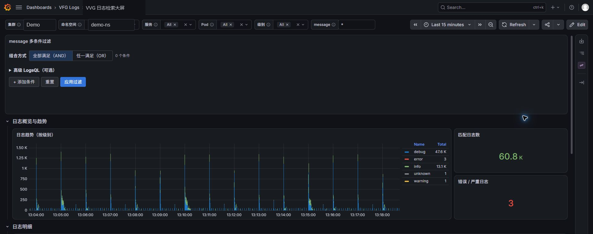
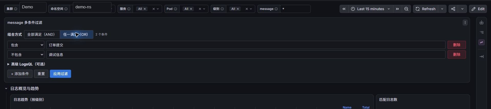

# VVG 日志收集系统

VVG (Vector → VictoriaLogs → Grafana) 是一个高性能的日志收集、存储、查询和可视化解决方案。

当前验证基线：Vector `0.58.0`、VictoriaLogs `v1.52.0`、Grafana `13.2.0-ubuntu`、VictoriaLogs datasource `0.31.0`、Business Text `6.3.0`。Grafana 插件采用版本化宿主机 release 目录和只读挂载，与 Grafana 镜像解耦，正式启动不联网安装。

生产升级和故障排查请先阅读 [AI Agent 配置与验收指南](docs/ai-agent-operations-guide.md)、[采集延迟运行手册](docs/vector-victorialogs-latency-runbook.md) 与 [查询性能运行手册](docs/grafana-victorialogs-query-performance-runbook.md)。日志检索大屏的字段契约、验证和回滚见 [生产日志检索大屏配置与导入指南](docs/grafana-victorialogs-log-search-dashboard-guide.md)。

## 🏗️ 系统架构

```
┌─────────────────────┐    ┌──────────────────────┐     ┌─────────────────────┐
│                     │    │                      │     │                     │
│      Vector         │────│    VictoriaLogs      │──── │      Grafana        │
│   (日志收集器)       │    │     (日志存储)       │     │    (日志可视化)      │
│                     │    │                      │     │                    │
│  • Nginx 日志       │    │  • 高性能存储         │     │  • 查询界面         │
│  • Java 多行日志    │    │  • 数据压缩           │     │  • 仪表板           │
│  • 数据处理和转换    │    │  • 快速检索           │    │  • 告警功能          │
│                     │    │                      │    │                     │
└─────────────────────┘    └──────────────────────┘    └─────────────────────┘
         :8686                       :9428                       :3000
```

## ✨ 核心特性

- **🚀 高性能**: VictoriaLogs 提供极高的写入和查询性能
- **📦 轻量级**: 相比 ELK 栈，资源占用更少
- **🔧 易部署**: Docker Compose 一键部署，vector支持kubernetes分布式部署
- **📊 可视化**: Grafana 提供强大的日志查询和可视化功能
- **🔍 智能解析**: 自动识别 Nginx 和 Java 日志格式
- **🔄 可靠传输**: 持久磁盘缓冲、背压和可回滚升级，后端短时维护不主动丢新日志
- **🧩 多条件检索**: message 包含/不包含、全局 AND/OR、显式 Apply/Reset、URL 状态恢复
- **⚡ 查询保护**: 默认 15 分钟、All 展开为 `*`、明细 500 行、输入期间零查询
- **🔒 可审计插件**: 精确版本、SHA-256、不可变 release、只读挂载和原子回滚

## 🖥️ 界面预览

生产与测试共享同一 Dashboard 逻辑。以下截图来自脱敏演示环境，实时计数仅用于展示布局。



多条件 message 过滤器支持逐行添加、包含/不包含和全局 AND/OR。编辑期间不查询，点击“应用过滤”后统一刷新四个面板。



## 📋 支持的日志格式

### Nginx 日志
- **Access Log**: 标准格式和 JSON 格式
- **Error Log**: 标准错误日志格式
- **自定义格式**: 支持自定义 log_format

### Java 应用日志
- **单行日志**: 标准 Java 应用日志
- **多行日志**: 异常堆栈、调试信息自动合并 ⭐
- **智能识别**: 支持时间戳和日志级别开头格式
- **双层处理**: 容器运行时层 + 应用层多行处理 ⭐
- **JSON 格式**: 结构化 Java 日志

## 🚀 快速开始

本系统支持多种部署方式，可根据实际环境选择合适的部署架构。

### 部署架构选择

**选项 1: 单机部署**
- 所有组件部署在同一台服务器
- 适合测试环境或小规模应用

**选项 2: 分布式部署** (推荐)
- VictoriaLogs: 部署在存储服务器
- Grafana: 部署在展示服务器  
- Vector: 部署在各个应用服务器

**选项 3: Kubernetes 部署** ⭐ 推荐
- 适合容器化环境和微服务架构
- 支持 Docker CRI 和 Containerd CRI
- **Java多行日志增强**: 异常堆栈自动合并 ⭐
- **双层多行处理**: 容器分割 + 应用层处理
- **持久可靠缓冲**: 每节点 1GiB 磁盘缓冲，后端短时维护不主动丢新日志
- **低延迟采集**: 5秒文件发现、活跃文件公平读取、1秒批次

### 部署步骤

#### 1. 部署 VictoriaLogs (日志存储)

```bash
cd docker-compose/victorialogs
cp env.example .env
# 编辑 .env 文件设置相关参数
sudo mkdir -p /data/victorialogs/victoria-logs-data
docker-compose up -d
```

详细说明: [VictoriaLogs 部署文档](docker-compose/victorialogs/README.md)

#### 2. 部署 Grafana (可视化界面)

```bash
cd docker-compose/grafana
cp env.example .env
# 编辑 .env，设置 VictoriaLogs 地址、管理员密码、数据目录和固定镜像
sudo bash ../../scripts/install-grafana-plugins.sh .env
sudo mkdir -p /data/grafana/grafana-data
sudo chown 472:472 /data/grafana/grafana-data
docker compose --env-file .env up -d
```

详细说明: [Grafana 部署文档](docker-compose/grafana/README.md)

#### 3. 部署 Vector (日志收集)

在每台需要收集日志的应用服务器上:

```bash
cd docker-compose/vector
cp env.example .env
# 编辑 .env 文件，设置 VictoriaLogs 服务器地址和日志路径
sudo mkdir -p /data/vector-docker/vector_data
docker-compose up -d
```

详细说明: [Vector 部署文档](docker-compose/vector/README.md)

#### 4. Kubernetes 部署 (可选) ⭐

在 Kubernetes 环境中部署 Vector 进行日志收集:

```bash
# 1. 修改 VictoriaLogs 地址
cd k8s-deployment
# 编辑配置文件，设置 VictoriaLogs 服务器地址

# 2. 根据容器运行时选择配置文件
# Docker CRI
kubectl apply -f vector-k8s-docker-cri.yaml

# Containerd CRI  
kubectl apply -f vector-k8s-containerd-cri.yaml

# 3. 验证部署
kubectl get pods -n logging
```

详细说明: [Kubernetes 部署文档](k8s-deployment/README.md)

### 验证部署

1. **检查 VictoriaLogs**
```bash
curl http://VictoriaLogs_IP:9428/metrics
```

2. **访问 Grafana**
```bash
# 浏览器访问
http://Grafana_IP:3000
# 默认账号: admin / 在.env中设置的密码
```

3. **检查 Vector 状态**
```bash
# Docker Compose 默认只绑定宿主机 loopback
curl http://127.0.0.1:8686/health

# Kubernetes 部署
kubectl get pods -n logging
kubectl logs -n logging -l app=vector --tail=50
```

### 配置校验

提交或部署前运行：

```bash
# 不需要 Docker，检查固定版本、危险默认值、凭据和关键基线
bash scripts/validate-configs.sh --static

# 需要 Docker；展开三套 Compose、构建并校验外置 Grafana 插件包，
# 并用 Vector 0.58 实际校验 Docker 与两套 K8S 配置
bash scripts/validate-configs.sh --runtime
```

Pull Request 和 `main` 分支会通过 GitHub Actions 重复执行完整校验。`.env`、`服务器信息.txt` 和运行数据目录不得提交到仓库。

已有 Grafana 迁移、隔离验证、Chrome 验收和回滚流程见 [VVG AI Agent 配置、升级与验收指南](docs/ai-agent-operations-guide.md)。

## 📁 项目结构

```
├── docker-compose/
│   ├── victorialogs/               # VictoriaLogs 存储
│   ├── grafana/
│   │   ├── dashboards/             # 生产 Dashboard JSON
│   │   ├── datasources/            # datasource provisioning
│   │   ├── panel-templates/        # 生成的 Business Text 面板模板
│   │   ├── docker-compose.yml
│   │   ├── env.example
│   │   └── README.md
│   └── vector/                     # Docker Vector
├── k8s-deployment/                 # Docker CRI / Containerd CRI Vector
├── scripts/
│   ├── install-grafana-plugins.sh  # 原子发布外置插件 release
│   ├── render-vvg-message-filter.mjs
│   ├── validate-vvg-message-filter.mjs
│   └── validate-configs.sh
├── docs/
│   ├── images/                     # 脱敏界面截图
│   └── ai-agent-operations-guide.md
├── AGENTS.md                       # AI Agent 全仓库约束
├── .github/workflows/              # PR/main 自动校验
├── LICENSE
└── README.md
```

## ⚙️ 配置说明

### 环境变量配置

每个服务的配置文件都位于对应目录下的 `env.example`，使用前需要复制为 `.env` 并修改相关参数:

- **VictoriaLogs**: 端口、数据保留期、存储路径
- **Grafana**: VictoriaLogs 地址、管理员密码、端口  
- **Vector (Docker Compose)**: VictoriaLogs 地址、日志文件路径、主机标识
- **Vector (Kubernetes)**: VictoriaLogs 地址、Java 多行日志增强处理、高性能缓冲配置

### 网络配置

各服务默认使用 `vvg-monitoring` 网络。分布式部署时，确保:
- VictoriaLogs 的 9428 端口可被 Grafana 和 Vector 访问
- Grafana 的 3000 端口可被用户访问
- Kubernetes 环境中 Vector 能访问 VictoriaLogs 服务
- 配置正确的防火墙规则

## 🔧 自定义配置

### 日志格式定制

编辑相应的配置文件可以:

**Docker Compose 部署**:
- 编辑 `docker-compose/vector/vector.yaml`

**Kubernetes 部署**:
- 编辑 `k8s-deployment/vector-k8s-*.yaml` 中的 ConfigMap

支持的自定义内容:
- 添加新的日志源
- 修改日志解析规则  
- 自定义数据处理逻辑
- 配置日志过滤条件
- Java 多行日志匹配规则

### 性能调优

根据数据量调整:
- **VictoriaLogs**: 内存限制和查询参数
  - 默认查询并发 4；仅在触顶/超时指标增长且资源有余量时提高
- **Vector**: 批处理大小和缓冲区配置
  - Docker file source：1秒发现 + 64KiB公平读取 + 10GiB磁盘缓冲
  - Kubernetes 版本：1MB/500事件批次 + 1秒超时 + 1GiB磁盘缓冲
  - 显式排除 `.gz/.tmp`，避免快速轮转文件晚读后批量涌入
  - 保留真实事件时间，不使用 `rewrite_timestamp` 掩盖积压
- **Grafana**: Explore 默认15分钟、最多500行、60秒数据源超时

## 📖 文档

- [故障排查指南](docs/troubleshooting.md)
- [Vector/VictoriaLogs 延迟排查与升级运行手册](docs/vector-victorialogs-latency-runbook.md)
- [Grafana/VictoriaLogs 查询性能与升级运行手册](docs/grafana-victorialogs-query-performance-runbook.md)
- [VictoriaLogs 部署说明](docker-compose/victorialogs/README.md)
- [Grafana 部署说明](docker-compose/grafana/README.md)  
- [Vector 部署说明](docker-compose/vector/README.md)
- [Kubernetes 部署说明](k8s-deployment/README.md) ⭐

## 🤝 贡献

欢迎提交 Issue 和 Pull Request！

## 📄 许可证

本项目采用 [MIT 许可证](LICENSE)。

## 🔗 相关链接

- [VictoriaLogs 官方文档](https://docs.victoriametrics.com/VictoriaLogs/)
- [Vector 官方文档](https://vector.dev/docs/)
- [Grafana 官方文档](https://grafana.com/docs/)

---

**注意**: 生产环境部署前请仔细阅读各服务的部署文档，确保正确配置安全和性能参数。 
