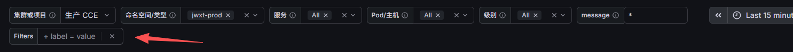

# 主机日志迁移与原生 Filters 实践

本文沉淀 2026-09-07 网大APP、老教务系统 PHP 的迁移和检索经验，供后续接入项目复用。
现场凭据、地址、完整清单、日志样本与运行快照不在仓库中；每次实施必须重新盘点。
本文说明操作顺序和判断依据，具体配置以生成器、Compose 与以下专项手册为准。

| 内容 | 配置与手册 |
| --- | --- |
| 部署、资源、首次切换及回滚 | [Compose 主机路线](../docker-compose/vector/host-automq/README.md) |
| Topic、身份、正文与标签 | [日志项目规范](log-project-naming-and-labels.md) |
| 原始格式、多行与目录边界 | [主机日志格式规则](host-log-format-rules.md) |
| Filters、message、布局及验收 | [日志大屏指南](grafana-victorialogs-log-search-dashboard-guide.md) |
| 内存、缓冲和恢复 | [Vector 内存与恢复手册](vector-memory-and-recovery-runbook.md) |

## 1. 先把业务来源映射清楚

以旧索引、Filebeat 启用配置、应用日志配置、容器挂载和真实文件共同建立来源表，
至少检查一周的活跃来源以覆盖低频服务。每项记录项目、服务、日志根目录、格式、
读取所有者、source ID 和旧采集状态。某个索引今天没有数据或 Redis list 为空，
不能证明该来源已经废弃。无法连接的主机应标为未验证，不能计入已完成覆盖。

本次保留以下业务决定：

| 范围 | project | service |
| --- | --- | --- |
| 网大 Java 与其他 PHP 应用 | `wangda-app` | Java 保持原服务名，PHP 加 `php_` 前缀 |
| 老教务后台及教务 API | `legacy-php` | 统一 `php_jxgl` |
| 莆田后台及 API | `legacy-php` | 统一 `php_jxgl-ptlndx` |

旧索引 `jxgl-ptlndx*` 和 `php_jxgl_log*` 是旧来源分类的两个例外，其他 PHP 归网大。
新增 API 根据确认的业务归属显式配置；不要把 `jxgl*` 扩大成通用分类正则。
后台和 API 不创建独立服务名。改服务标签时保留 source ID、fingerprint 和 state，
历史记录的旧标签不回写。CCE 采集与 Nginx access/error 日志不在本次迁移范围。

每个项目一个 Topic、一个消费者组和一个 Vector 消费者，多个服务用字段筛选。
沿用 `logs.<environment>.<project>.v1`，后续增加服务不增加 Topic 或消费者。
吞吐与恢复目标确有需要时再扩容；项目下拉框只用于检索，不提供租户访问隔离。

## 2. runtime 全面盘点，按确认的日志根目录递归

从应用配置和代码确认 runtime 下每个目录的用途，再为真实日志根目录配置
`**/*.log`、`**/*.jsonl`、`**/*.ndjson`。同时验证根目录直属文件、日期子目录和更深
层级。不要只覆盖当天目录，也不要把整个 runtime 作为文本日志来源。

runtime 内可能包含 session、cache、临时文件和推送账号列表。曾遇到 `push/*.txt`
实际保存收件账号的情况，只有检查写入函数后才能判定其用途。新增扩展名同样要先
确认内容和生产方式；`.nfs*` 等临时文件不能仅凭出现位置新增为采集来源。

检查容器 bind mount、宿主机挂载及 NFS 路径是否最终指向同一份文件。多个 API 实例
共享 runtime 时，指定一个读取所有者，在另一写入端产生受控唯一标记并验证只入库
一次。此时 `instance/pod` 表示读取主机；需要定位实际写入实例时，应用必须写入
实例字段或分开文件，采集端不能凭共享文件推断。

## 3. 正则必须来自真实日志边界

先在受控临时目录按格式、文件和大小抽样，覆盖正常请求、异常、SQL、CLI、XML、
嵌套数组、有效 JSON 和旧 Logback 非法 JSON 包装。只将脱敏后的同结构合成样本
加入回归，生产正文不得进入测试仓库。

Java 按完整日志头合并堆栈；ThinkPHP 按请求头、下一边界和空闲超时合并请求块。
无关联 ID 的独立输出不能强行拼成同一请求。嵌套且缩进的 `array` 不应触发新事件，
不同文件或服务绝不合并。详细边界以[格式规则](host-log-format-rules.md)为准。

虚线不能独立作为业务日志。仅过滤纯空白及只含至少五个 `-` 或 `=` 的格式事件，
保留正文内部内容，并单独解释 `drop_formatting_noise` 的 intentional 计数。
不要通过扩大丢弃正则来掩盖错误的多行边界。

优先用 JSON 解析器处理合法 JSON，解析失败后只剥离已经确认的旧 message 包装。
正常长堆栈不按固定行数拆分。物理行上限、序列化大小和显式截断仍然有效，不能把
正常长日志回归通过解释成所有超大日志无损。

隔离回放应复用实际每台主机的处理拓扑。同类样本共用格式处理链，避免给每个样本
文件创建独立 transform 而人为放大内存。隔离测试 OOM 时先核对拓扑与内存构成，
不能直接移除生产资源边界。需要验证的行为包括重启恢复、轮转、跨文件隔离、正文
内容、深层目录、脱敏和纯分隔线为零；测试入口见文末。

## 4. 正文从采集到复制 JSON 的完整契约

```text
原始文件 -> 解析/多行/脱敏 -> Kafka message
         -> consumer: ._msg = string!(del(.message))
         -> VictoriaLogs _msg
         -> 明细查询: | copy _msg as message -> Grafana labels.message
```

Kafka 与 VictoriaLogs 各只存一份正文，复制别名只出现在最多 500 行的明细查询。
顶部 `message` 变量通过 `_msg:$message` 搜索正文，原生 Filters 负责 `file` 等字段。
趋势和统计无需复制 message。不要把整个结构化事件重新编码进 message。

只看行数、HTTP 200 或容器 Running 无法发现正文映射错误。每种格式都要核对一条
真实事件的脱敏正文、换行、业务时间、项目和服务，并用正文片段再次搜索同一记录。
新日志不应含 `missing _msg field` 占位文本。历史错误映射记录不会因修复消费者而
自动恢复；排查时检查历史 `message` 字段，不为修复显示而重置全部 offset 或重放
全部 Topic。历史数据修复必须另行评估重复入库和成本。

## 5. 首次迁移与日常恢复必须分开

1. 备份旧 Filebeat 配置、registry、unit、版本及可执行文件，生成 SHA-256。
2. 准备已校验的 Harbor 固定版本镜像、独立项目身份及消费者，生成候选配置。
3. 使用目标机器的 Compose 版本展开候选，再用同版本 Vector 隔离校验与回放。
4. 仅在允许少量日志丢失的首次窗口使用 `--initial-tail`，小范围观察后逐机切换。
5. 优雅停止采集器，保留已有 checkpoint；为已存在但尚无位置的文件执行一次性
   EOF 初始化，再以同一 source ID、fingerprint、state 切回 `read_from: beginning`。
6. 核对真实 Kafka committed/end offset、实际业务日志、轮转恢复和资源，再停止、
   禁用并卸载对应 Filebeat 包。每台保留回滚归档与完成时间。

静默文件可能在尚无新事件时未生成 EOF checkpoint，不能认为短暂运行 initial-tail
已经持久化所有文件位置。EOF 工具仅在采集器停止时使用，device/inode/size 来自
目标机。日常升级、重启或恢复不得再次跳到 EOF，也不能清空 state。

持久化在 Compose 当前目录的子目录中。采集端使用 `/data/vector/`，项目消费者
使用独立目录，数据盘路径和容量先核实。回滚保留 Vector state、Kafka 消息及旧
registry；可能重复的时间窗需记录。旧 ELK、Redis 和历史数据的退役另行安排。

### 老环境的部署细节

- Harbor 域名证书正常不代表认证入口正常，认证 realm 也可能指向不匹配的地址。
  无法直接拉取时传输受控主机验证过的镜像归档，记录源 digest、image ID 与实际
  传输归档的 SHA-256。不同归档的 tag 元数据可能不同，不能只比较另一份归档的哈希。
  不通过关闭 TLS 校验或重启 Docker daemon 绕过问题。
- 通过 SSH `bash -s` 运行部署脚本时，交互式子命令可能消耗后续脚本的标准输入。
  不需要交互的容器校验使用 `</dev/null`，检查退出状态以及后续步骤的实际结果。
- 老 Compose 的一次性 `run` 可能注入与 host network 不兼容的 links。离线语法校验
  可用独立 `docker run --network none` 挂载候选执行 `vector validate --no-environment`；
  该检查不证明 Kafka、密码和后端可达，运行后的端到端验收仍须执行。

## 6. Filters 固定显示，沿用 Grafana 原生能力

日志详情加号自动出现的 Filters 是 Grafana 的 ad hoc 变量。将它作为空条件、可见的
固定变量保存到 Dashboard，即可在首次打开和清空条件后继续显示，无需新增筛选面板。

生成源为 `scripts/render-vvg-message-filter.mjs`。保持唯一的 `Filters`，绑定
`victorialogs-ds`，使用 `type: adhoc`、`hide: 0`、空 `filters/baseFilters`、
`allowCustomValue: true` 和 `skipUrlSync: false`。字段条件由数据源插件应用于明细、
统计和 hits 趋势；不要再向四条查询拼接自制 raw 字段表达式。



验收必须从不带旧 Filters URL 参数的页面开始：控件已经显示；添加不可能匹配的
`file` 条件后，两个统计为零，明细和趋势无数据；清空后结果恢复且控件仍在；刷新
及复制 URL 可以恢复条件；日志详情加减号继续更新同一控件。原生 Filters 自行清空，
message 多条件面板的 Reset 只重置自己的条件，二者不互相代替。

Dashboard 变更通过 API 更新定义，不重启 Grafana 或采集器。测试和生产沿用相同
生成逻辑，最后恢复最近 15 分钟、零字段条件、零 message 多条件、自动刷新关闭。

## 7. 趋势波峰与链路健康分开验证

周期性波峰首先按项目、服务、level 缩小范围，对照源文件业务时间的同时间桶计数。
PHP SQL 调试或定时任务可以产生周期性输出，但图形相似不能单独证明链路正常。
若 Kafka lag、buffer 和事件到达延迟同时增长，则继续排查生产、消费和后端写入；
若源文件本身具有相同周期且这些指标正常，再判断为业务输出节奏。

保留 `hits/logsVolume`、按 level 分组、`maxDataPoints: 100` 和 `barWidthFactor: 0.6`。
不要仅为消除波峰改变采样、隐藏 debug 或关闭应用 SQL 日志。

指标能由中心拉取时使用 pull；受网络限制时可由现有 Vector 每 15 秒推送到组织
已有的 Remote Write 接收端。推送使用独立有界指标队列，不增加项目消费者。
pull 的 `up` 与 push 序列新鲜度分别验收，删除重复不可达的 scrape target。
仓库有告警模板不等于规则已启用，必须在目标监控系统核对规则和通知路由。

## 8. 交付检查

```bash
node scripts/render-vvg-message-filter.mjs
node scripts/validate-vvg-message-filter.mjs
bash scripts/validate-configs.sh --static
python3 scripts/test-host-log-runtime.py
git diff --check
```

静态检查包含生成配置和单元回归；运行回归需要 Docker，在隔离环境执行。
配置、规则、合成测试、文档及已脱敏截图一起交付。PR 检查通过后合并，再针对实际
main 提交重验并发布 Release。Release 不等于重新部署生产；部署版本与实时健康
必须另取现场证据，不能用历史记录代替。
