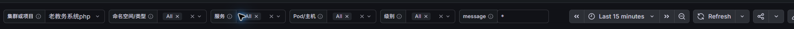

# 日志项目、Topic 和标签约定

Topic 按环境和项目隔离，服务与实例用标签筛选。项目拥有独立的保留策略、生产者身份、
消费者身份、ACL、消费者组和可观测消费进度。不要把所有项目长期放入 `host.logs.v1`，
也不要按每个 Java/PHP 服务或每台主机创建 Topic。

## 命名

| 对象 | 规则 | 当前两个项目 |
| --- | --- | --- |
| project ID | 稳定小写 slug，显示名可独立修改 | `wangda-app`、`legacy-php` |
| environment | `prod/stage/test/dev` | `prod` |
| Topic | `logs.<environment>.<project>.v<schema>` | `logs.prod.wangda-app.v1`、`logs.prod.legacy-php.v1` |
| VictoriaLogs group | `vmlogs.<environment>.<project>.v<schema>` | `vmlogs.prod.wangda-app.v1`、`vmlogs.prod.legacy-php.v1` |
| producer user | `logs-<environment>-<project>-producer` | 两个项目独立 |
| consumer user | `logs-<environment>-<project>-consumer` | 两个项目独立 |

不把中文显示名、服务器地址、版本发布时间、客户个人信息或服务名写入 Topic。
`v1` 是事件契约版本，不随 Vector 镜像升级、业务发布或增加兼容字段递增。只有不兼容
的时间、字段语义或编码变更才创建 v2，经过并行验证、切换、排空后再退役 v1。

本次网大APP使用 6 分区，老教务 PHP 使用 3 分区，保留期先统一 72 小时。
后续普通新项目先用 3 分区，根据实际字节吞吐、分区倾斜、单分区消费速率和恢复目标
决定是否增加。不能按服务数量直接增加分区；增加分区会改变 key 的映射，需要安排
维护窗口和核对相同实例日志的相对顺序。

已有 CCE 的 `vvg.logs.v1` 和 Gateway 的 `gateway.access.v1` 保持当前生产契约，纳入
登记表作为历史名称。它们的重命名是另一项有明确切换和排空计划的迁移，不能顺带执行。

## 标签契约

| 字段 | 含义 | 流字段 |
| --- | --- | --- |
| `project` | 稳定项目 ID | 是 |
| `project_name` | 中文显示名 | 否 |
| `environment` | 环境 | 是 |
| `service` | 稳定服务名，不含发布 tag、PID | 是 |
| `instance` | 该服务的稳定主机名，容器/K8S 路线使用实例身份 | 是 |
| `level` | `trace/debug/info/warn/error/critical/unknown` | 是 |
| `source_kind` | 本路线固定 `file` | 否 |
| `language` | `java/php/text` | 否 |
| `log_type` | 本路线固定 `application`，后续访问/审计流单独登记 | 否 |
| `file`、`source_offset` | 文件定位信息 | 否 |
| `schema_version` | 事件契约版本 | 否 |
| `message` | 采集和 Kafka 中唯一的日志正文，消费者显式转为 `_msg` | 否 |
| `legacy_index` | 迁移来源索引映射，用于对账 | 否 |

`cluster/project`、`container/service`、`pod/instance` 是当前 Dashboard 的兼容别名。
主机路线的 `cluster` 是项目筛选兼容字段，不代表真实 Kubernetes 集群；未来真实集群
身份使用独立 `cluster_id`，不要写主机地址或把项目 ID 冒充物理集群。
原始时间在 Vector 内为 timestamp，通过 AutoMQ 时间字段传递，并恢复为 VictoriaLogs
的 `_time`。trace ID、用户 ID、请求 URL、原文和 offset 都不能成为流标签。

## 正文约定

Java JSON、普通文本、ThinkPHP 多行和 CLI 日志在采集阶段统一为字符串 `message`。
传入 Kafka 的正文只有一份，不把整条结构化事件再次序列化塞进 `message`。
消费者通过 `._msg = string!(del(.message))` 明确映射为 VictoriaLogs 原生正文，再用
Loki JSON 编码入库；其余结构化标签和真实时间保留。最终存储只保留 `_msg` 一份正文，
避免正文双份编码放大。大屏名为 message 的搜索框继续使用 `_msg` 索引搜索和高亮。
日志明细查询末尾使用 `| copy _msg as message`，让 Grafana 展开详情和复制 JSON 时具有
`labels.message`，与 CCE 的排查体验保持一致。复制只发生在最多 500 行的明细返回中，
趋势和统计不增加此字段；AutoMQ 和 VictoriaLogs 持久化均不存两份正文。

主机项目 consumer 的 Loki sink 使用 `remove_label_fields: true`：先生成原有流标签，
再从 JSON 载荷移除已经用于标签的字段。字段继续随 Loki stream 发送，VictoriaLogs
查询仍返回它们；流标签、`_stream_id`、正文与大屏兼容别名不变。它节省消费者到
VictoriaLogs 的重复编码与传输，不改变 Kafka 事件，也不减少 `_stream` 的展示。
CCE/Gateway 的 consumer 不随主机路线修改。回归入口
`scripts/test-host-consumer-labels.py` 对比真实 Vector 载荷，并通过隔离 VictoriaLogs
确认前后字段、时间、流 ID、长正文及 file 查询相同；不以合成样本比例承诺实际压缩收益。

不能只验证行数或 HTTP 成功：每种日志格式至少抽样核对 `_msg` 等于脱敏后的原正文，
包含换行的正常长日志完整，`missing _msg field` 不出现在新记录中，message 条件查询
能命中同一条记录。某些 Loki JSON 自动解析路径不会把 `message` 自动指定为正文。
参见 [VictoriaLogs 消息解析](https://docs.victoriametrics.com/victorialogs/data-ingestion/promtail/)。

项目和环境由部署清单决定，不能相信业务 JSON 中同名字段。一次 Compose 只绑定一个
项目；同一主机若服务于多个项目，部署多个独立 Compose project，各自保留 state、
密码与指标端口。新项目的 inventory 显式设置 `project/project_name/environment`；
生成器同时输出 `route.json`，供运维核对 Topic、group 和身份。

`docker-compose/grafana/project-scopes.json` 是项目显示名称登记表。接入新项目时增加
稳定 ID 和名称，再运行 Dashboard 生成器；无需手改四个面板的 LogsQL。采集生成器也
读取该登记表，避免清单中的项目显示名与大屏各维护一份。新增项目仍需完成 Topic、
独立身份、一个消费者及真实端到端探针验证。

## 权限与生命周期

每个 producer 只写自己的 Topic，每个 consumer 只读自己的 Topic 和固定 group。
管理员只用于建 Topic、SCRAM 和 ACL，不在常驻 Vector 中使用。不同下游，例如未来
ClickHouse、审计或离线重放，必须使用独立 group，不能加入 VictoriaLogs 的 group
分走它的消息。增加同一 group 的消费者可以水平扩容，但有效并行上限取决于分区数。

项目标签隔离检索，Topic ACL 隔离消息访问。当前 Grafana datasource 共用 VictoriaLogs
租户，Dashboard 下拉框不是权限边界；将来需要不同团队或客户的访问隔离时，应同时
增加独立租户和受控数据源，不能只隐藏项目选项。

临时 `host.logs.v1` 的迁移期消息排空后停止临时消费者；已经入库的日志继续保留。
不要重置其 offset 或让两个独立 group 再次全量消费。旧 Topic 先禁止生产并留到保留
期结束，确认不再回滚后再单独清理。本次日志数量对账需合并项目 Topic 切换前后窗口。
